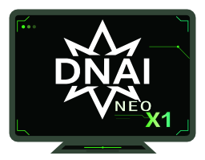

# DNAI WORKSTATION NEO X1



## Resumo

Orquestrador de IA local que implementa um loop LLM rigoroso:
**planear → escolher ferramenta MCP → chamar → verificar → repetir**.

O agente — **NEO X1** — corre 100% na máquina do utilizador: o modelo é
servido pelo LM Studio (API OpenAI-compatible) e as ferramentas por
servidores MCP locais. Sem dependências de serviços cloud.

## Funcionalidades

- **Chat CLI com memória entre turnos** (`interfaces/cli_chat.py`) — o
  histórico da conversa é mantido e passado ao orquestrador a cada turno.
- **Arranque automático do LM Studio** (`core/lm_studio.py`) — ao abrir a
  interface, se o servidor local não estiver ativo, é arrancado via CLI
  `lms` e o modelo configurado é carregado automaticamente.
- **Identidade configurável** (secção `persona` do config.yaml) — o agente
  responde como NEO X1 através de uma *system prompt* injetada a cada
  chamada, sem poluir o histórico.
- **Ferramentas MCP reais** — o modelo pode pedir tool calls que são
  executadas via sessão MCP (ex.: `mcp-server-git`) e os resultados são
  devolvidos ao modelo para gerar a resposta final.
- **Truncagem de histórico** — proteção simples contra estourar o contexto
  do modelo (`memory.max_history_messages` no config.yaml).

## Estrutura do Projeto

```
DNAI WORKSTATION NEO X1/
├── assets/                  # Logotipo (PNG/SVG)
├── config/
│   └── config.yaml          # Configuração central (modelo, API, persona,
│                            #   auto-start LM Studio, servidores MCP)
├── core/
│   ├── orchestrator.py      # Núcleo: loop LLM + tool calls MCP + memória
│   └── lm_studio.py         # Health check + arranque automático do LM Studio
├── interfaces/
│   └── cli_chat.py          # Interface de chat CLI
├── run.ps1                  # Lançador (PowerShell)
└── requirements.txt         # Dependências Python
```

> Nota: `test_smoke.py` (diagnóstico local de ligação) existe na máquina de
> desenvolvimento mas não é versionado — ver `.gitignore`.

## Requisitos

- **Python 3.11+**
- **LM Studio** instalado, com o CLI `lms` disponível no PATH
  (versões recentes instalam-no por defeito em `%USERPROFILE%\.lmstudio\bin`)
- Um modelo descarregado no LM Studio correspondente a `model.name`
- Git (para clonar o repositório)

## Instalação

1. Clonar o repositório:
   ```bash
   git clone https://github.com/DarkHareVideoGames/DNAI-WORKSTATION-NEOX1.git
   cd DNAI-WORKSTATION-NEOX1
   ```

2. Criar o ambiente virtual:
   ```powershell
   python -m venv .venv
   ```

3. Instalar as dependências:
   ```powershell
   .venv\Scripts\pip.exe install -r requirements.txt
   ```

4. Ajustar `config/config.yaml` se necessário (nome do modelo, porta do
   LM Studio, persona).

## Uso

Opção 1 — lançador PowerShell:
```powershell
.\run.ps1
```

Opção 2 — direto:
```powershell
.venv\Scripts\python.exe interfaces\cli_chat.py
```

Escreva mensagens no prompt `Tu:`; escreva `sair`, `exit`, `quit` ou prima
Ctrl+C para terminar.

### Diagnóstico rápido

Para verificar ligações (LM Studio, MCP, modelo) sem abrir o chat:
```powershell
.venv\Scripts\python.exe test_smoke.py
```

## Configuração (`config/config.yaml`)

| Secção | Chave | Descrição |
|---|---|---|
| `model.name` | — | Modelo a usar no LM Studio |
| `api.base_url` | — | Endpoint OpenAI-compatible do LM Studio |
| `persona.system_prompt` | — | Identidade injetada como system prompt |
| `lm_studio.auto_start` | `true/false` | Arrancar o servidor se estiver desligado |
| `lm_studio.startup_timeout_seconds` | — | Tempo máximo de espera após arranque |
| `lm_studio.load_model_on_start` | `true/false` | Carregar o modelo automaticamente |
| `memory.max_history_messages` | — | Limite de mensagens no histórico |

## Contribuições

Contribuições são bem-vindas. Por favor, forneça pull requests para adicionar
novas funcionalidades, corrigir bugs ou melhorar a documentação.

## Licença

Este projeto está licenciado sob a Licença MIT.